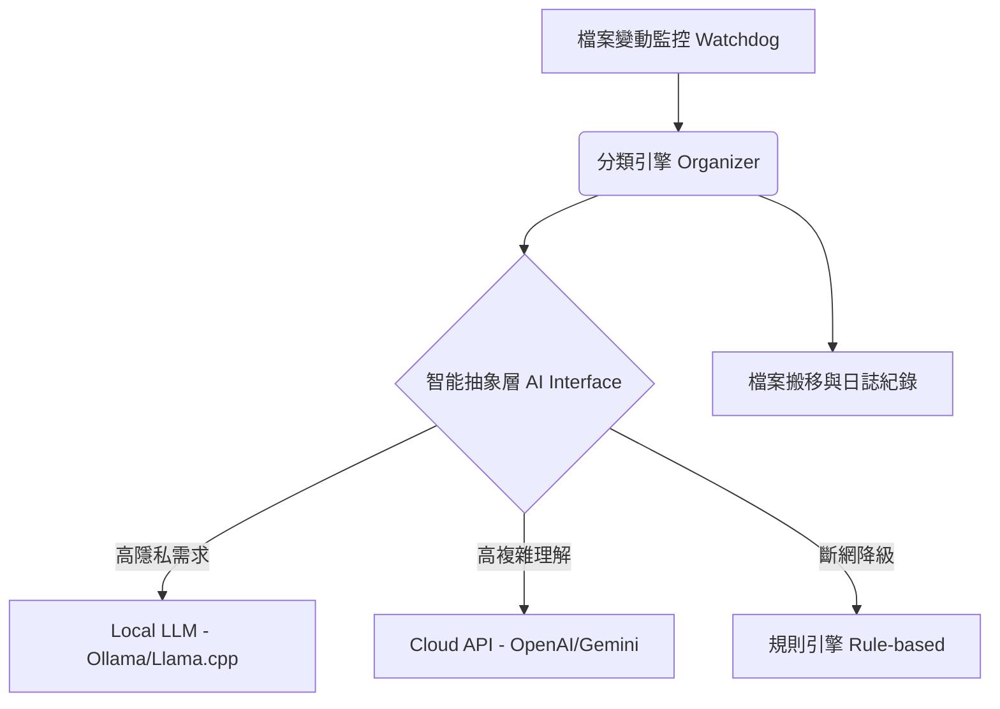

# File Organizer AI - 系統架構設計

## 1. 系統願景 (System Vision)
本專案旨在建立一個**混合式 (Hybrid)** 檔案整理架構。透過結合「基於規則的初步過濾 (Rule-based)」與「大型語言模型 (LLM) 的深度語意解析」，提供高效、準確且兼顧隱私的數位資產治理方案。

## 2. 核心模組 (Core Modules)

### 2.1 CLI 介面層 (`main.py`)
- **職責**：處理使用者輸入、參數解析 (`--dir`, `--dry-run`) 與視覺化反饋。
- **設計考量**：保持介面輕量，所有的複雜邏輯均下放至 `core` 模組。

### 2.2 整理引擎 (`core/organizer.py`)
- **職責**：執行檔案系統操作 (I/O)，生成並執行分類計畫。
- **工作流**：
  1. 掃描目標目錄 (排除隱藏檔與系統檔)。
  2. 將檔案清單傳遞給 `AIModel` 獲取分類建議。
  3. 產出執行計畫 (Plan) 並供使用者預覽。
  4. (可選) 執行檔案搬移。

### 2.3 智能抽象層 (`models/ai_interface.py`)
- **職責**：將具體的 AI 提供者（如 OpenAI API 或本地 Ollama 模型）抽象化。
- **優勢**：
  - **模組化**：可以無縫切換不同的底層模型，不影響主程式邏輯。
  - **隱私控制**：未來可在此層實作「資料脫敏 (Data Masking)」，在送上雲端前移除敏感字元。
  - **Fallback 機制**：若網路斷線，可自動降級使用本地的規則引擎 (Mock 模式)。

## 3. 未來架構藍圖 (Future Roadmap)

## 4. 效能與安全性考量
- **Batch Processing**：未來在傳送 API 請求時，將採用批次處理 (Batch) 以減少 Token 消耗與請求時間。
- **Dry-run 優先**：強制實作 `--dry-run` 模式，避免因 AI 幻覺 (Hallucination) 導致檔案被錯誤搬移。
